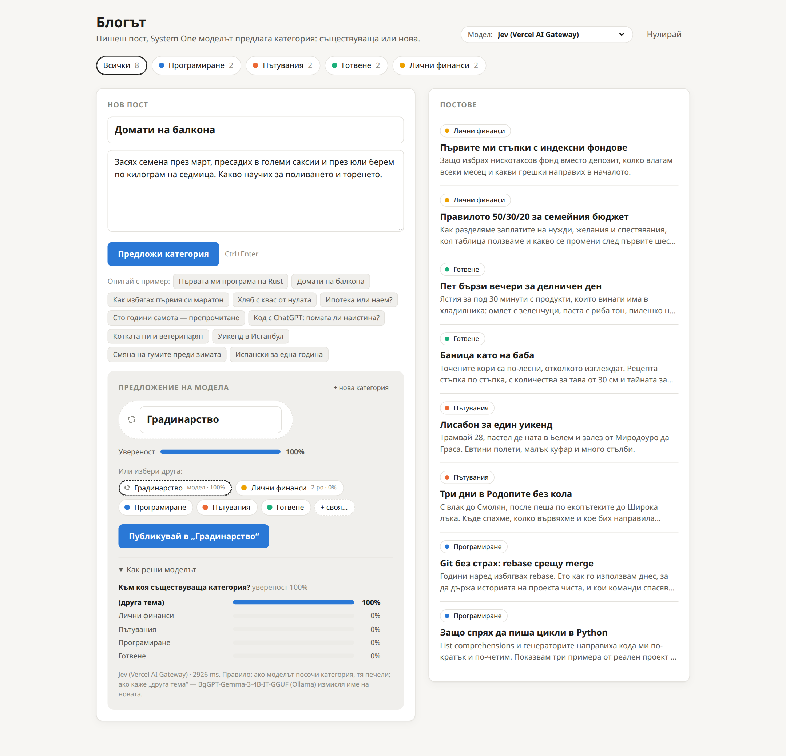
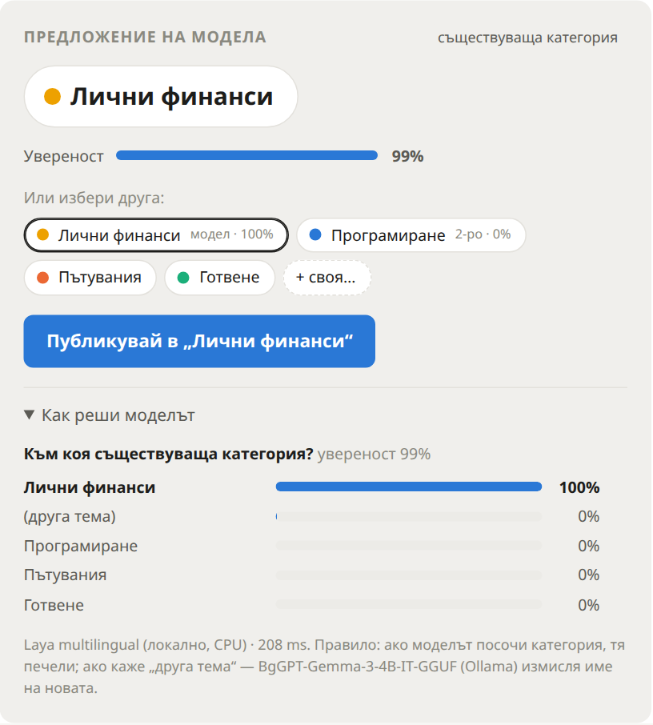
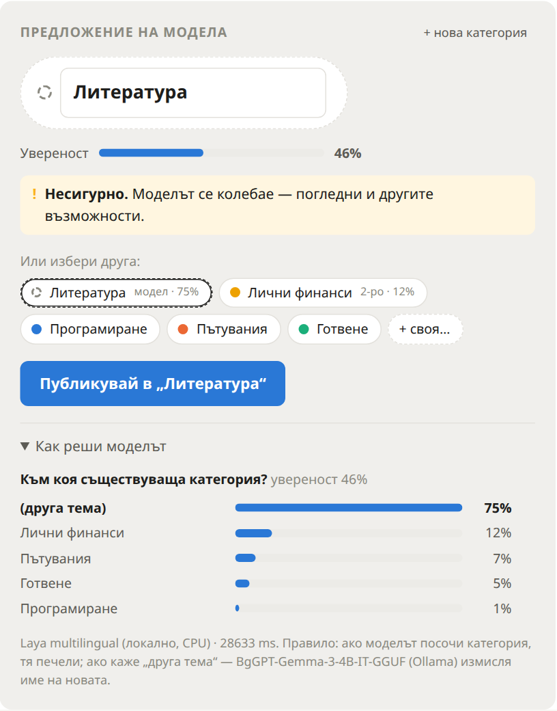
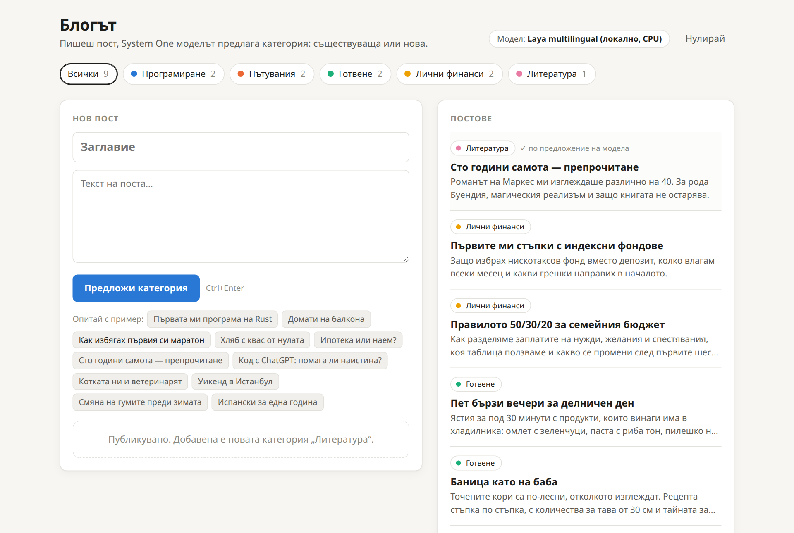

# System One категоризатор: Jev срещу Laya на български (демо)

> **In English.** A small demo app and a side-by-side test of two *System One*
> models on **Bulgarian** text: the closed **Jev** (TypeSafe API) and the open
> **Laya multilingual** (runs locally on the CPU). The task: suggest a category
> for a blog post, either an existing one or "new topic". On 50 labeled Bulgarian
> posts Jev got **48/50** right and Laya **36/50**. When a post needs a new
> category, a small local LLM (BgGPT 4B) names it. UI, posts and categories
> are in Bulgarian. MIT licensed.

Малко демо приложение с две цели:

1. **Сравнение на Jev и Laya на български.** Двата System One модела решават
   една и съща задача върху едни и същи 50 поста. Моделът се сменя от меню,
   без промяна в кода.
2. **Работещ пример за System One модел в приложение.** Пишеш блог пост,
   моделът предлага категория (съществуваща или нова), ти приемаш или
   поправяш с едно щракване.

## Резултат накратко

50 кратки поста на български с верен отговор (`eval_posts.json`): 28 по
четирите начални категории, 22 по теми, които ги няма. Измерено на 24.09.2026.

| | Laya multilingual | Jev (`jev-latest`) |
|---|---|---|
| Вярно предложение | 36/50 | **48/50** |
| Съществуваща категория | 24/28 | **28/28** |
| Нова тема ("друга тема") | 12/22 | **20/22** |
| Вярно при увереност >= 0,95 | 13/15 | 44/44 |
| Означени като "Несигурно" (< 0,5) | 17/50 | 0/50 |
| Време на заявка, медиана | 200 ms, локално | 380 ms, през API |
| Цена за 50 поста | 0 | около $0.001 |

- **Jev** е по-точен, особено при новите теми, и увереността му е надеждна.
- **Laya** е безплатен и работи без мрежа, но често натиква новата тема в
  съществуваща категория (шах -> "Лични финанси").

Подробности: [Резултати](#резултати).



## Как работи

1. **System One модел** (Laya или Jev) отговаря на един въпрос с избор: към
   коя от категориите на блога е постът, или "друга тема". Пуска се за всеки
   пост.
2. **Малък генеративен LLM** (голям езиков модел), BgGPT 4B през Ollama, се
   пуска само при "друга тема". Той измисля име на новата категория (на
   български) и кратко описание (на английски). Тази стъпка е отделна,
   защото System One моделът не пише текст.
3. **Човекът** приема или поправя. Моделът не решава сам.

Приложението показва и втората възможност, за поправка с едно щракване.
При увереност под 0,5 предложението е означено като "Несигурно". Панелът
"Как реши моделът" показва вероятността за всяка категория.

| Съществуваща категория | Нова категория |
|---|---|
|  |  |
| Пост за ипотека: уверено "Лични финанси". | Пост за "Сто години самота": "друга тема", BgGPT предлага "Литература". |

Новата категория влиза в блога заедно с описанието си, и от следващия пост
моделът я предлага като съществуваща. Всеки пост пази какво е предложил
моделът (`suggested`), за да се вижда кое е прието и кое поправено.



## Модели

| Стъпка | Модел | Къде върви | Лиценз |
|---|---|---|---|
| 1 (по подразбиране) | [Laya multilingual](https://huggingface.co/convaiinnovations/laya-multilingual), пакет `laya` | локално, CPU | Apache 2.0 |
| 1 (по желание) | Jev, през TypeSafe API или Vercel AI Gateway | облак, иска API ключ | платен API |
| 2 | [BgGPT 3.0 4B](https://huggingface.co/INSAIT-Institute/BgGPT-Gemma-3-4B-IT-GGUF) на INSAIT (Gemma 3, дообучен за български), Q4_K_M, 2,5 GB | локално, през [Ollama](https://ollama.com) | Gemma |

Моделите не са в репото. Изтеглят се при инсталирането и важат техните лицензи.

## Инсталиране

Нужни са Python 3.10+ и, за стъпка 2, [Ollama](https://ollama.com).
Командите са с [uv](https://docs.astral.sh/uv/); с `python -m venv` и `pip`
става същото.

```bash
git clone https://github.com/SciScend/system-one-categorizer-demo.git
cd system-one-categorizer-demo

uv venv && source .venv/bin/activate
uv pip install torch --index-url https://download.pytorch.org/whl/cpu   # torch само за CPU
uv pip install -r requirements.txt                                      # laya

# генераторът на имена (веднъж, 2,5 GB)
ollama pull hf.co/INSAIT-Institute/BgGPT-Gemma-3-4B-IT-GGUF:Q4_K_M
```

Без Ollama приложението работи, но името на новата категория го пишеш ти.
Друг модел за имената се задава с `NAMER_MODEL`, друг адрес на Ollama с
`OLLAMA_HOST`.

### Jev (по желание)

```bash
uv pip install typesafe-sdk==0.7.1
echo 'AI_GATEWAY_API_KEY=vck_...' > .env   # ключ от Vercel AI Gateway
```

Ключ `vck_...` праща заявките към `https://ai-gateway.vercel.sh/typesafe`.
За директния API на TypeSafe задай `TYPESAFE_API_KEY` и `TYPESAFE_BASE_URL`.
Променливите от средата имат предимство пред `.env`.

## Пускане

```bash
python app.py                  # http://127.0.0.1:8770, Laya по подразбиране
python app.py --backend jev    # Jev по подразбиране
python app.py --port 8771      # ако портът е зает
```

Моделът се сменя от менюто "Модел" горе вдясно; изборът се помни в браузъра.
Моделът по подразбиране се зарежда при старта (Laya: 15-45 s; при първото
пускане се изтегля от Hugging Face), другият при първата заявка към него.
BgGPT се зарежда за ~30 s.

Състоянието на блога е в `data/blog.json`. Бутонът "Нулирай" го връща към
`seed.json` (4 категории, 8 поста).

## Резултати

### Как да ги повториш

```bash
python evaluate.py                                              # 11 поста, test_posts.json
python evaluate.py --posts eval_posts.json                      # 50 поста, Laya
python evaluate.py --posts eval_posts.json --backend jev        # 50 поста, Jev
python evaluate.py --posts eval_posts.json --out results.json   # резултат за всеки пост в JSON
```

Всеки пост се сравнява с четирите начални категории от `seed.json`; нищо не
се записва в блога. При пост по нова тема се мери само дали моделът е казал
"друга тема". Името от BgGPT е свободен текст и не се сравнява.

### Грешките

- **Jev** (2): "Персеидите над Родопите" и "Птиците на Бургаските езера" ->
  "Пътувания". И двата поста са на границата.
- **Laya** (14): 10 нови теми, сложени в съществуваща категория, и 4 поста
  в грешна съществуваща категория.

При натоварване Vercel AI Gateway връща 429, затова `JevBackend` повтаря
заявката до 6 пъти. Jev използва около 500 входни токена на пост.

### Какво помогна при настройката

- **Кратки английски описания** на категориите ("travel", "cooking"). С дълги
  описания Laya се залепваше за общи думи и точността падаше.
- **Многоезичният Laya.** Английският модел `laya` не разбира български и
  грешеше почти всичко.
- **Един пример в заявката към BgGPT** (few-shot). Без него описанието на
  новата категория често излизаше на български или беше цяло изречение.

### Ограничения

- Тестовите постове са кратки (заглавие и две изречения) и са написани
  специално за теста. 50 поста дават посока, не точна оценка.
- Категориите не растат по време на теста, за разлика от истинския блог.
- Приложението е демо: един потребител, локален сървър, заявките към модела
  вървят една по една.

## Файлове

| Файл | Какво съдържа |
|---|---|
| `classifier.py` | въпросът, двата бекенда (Laya, Jev), генераторът на имена (Ollama), правилото за решение |
| `app.py` | уеб сървър (само стандартната библиотека) и JSON API |
| `index.html` | интерфейсът, без build стъпка |
| `evaluate.py` | мери точността |
| `seed.json` | началото на блога: 4 категории, 8 поста |
| `test_posts.json` | 11 поста с верен отговор; и бутоните "Опитай с пример" |
| `eval_posts.json` | 50 поста с верен отговор, за сравнението |

## Идеи за продължение

- **Каскада:** Laya за всички постове, Jev (или човек) само при "Несигурно".
  Върху `eval_posts.json` това би дало 43/50 с 17 заявки към Jev. Числото е
  сметнато от резултатите на двата модела, не е пускано като отделен режим.
- Събиране на поправките (`suggested` != `category`) като нови тестови постове.
- Втори въпрос (да/не) "постът е по няколко теми" и предложение за две категории.

## Лиценз

Кодът е под [MIT](LICENSE). Моделите са под своите лицензи (виж [Модели](#модели)).

Автор: Ива Попова, [SciScend](https://sciscend.com).
